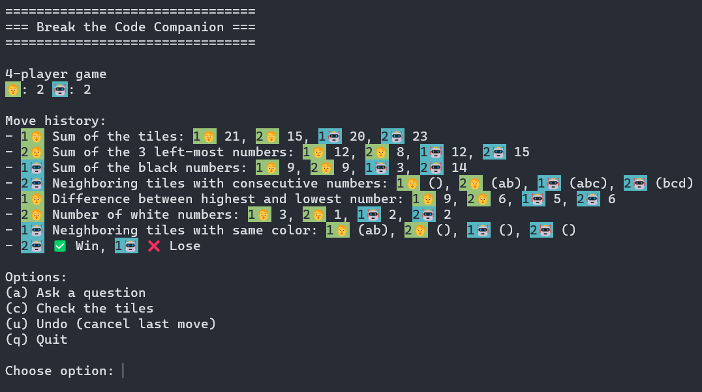

# Break the Code Helper

This program is an interactive helper for the game [Break the Code](https://boardgamegeek.com/boardgame/227466/break-code) that can be played online on [Board Game Arena](https://boardgamearena.com/gamepanel?game=breakthecode).

## Features

- Keeps track of your hints.
- As the game moves on, automatically updates a board that tells you which tile can possibly be found in which position in the opponent(s) hand.
- Shows you all possible remaining combinations for the opponent(s) tiles.
- A simulator allows you to estimate the best hint to choose from the available hints.

## Screenshots

### 2-player game

### 3-player game

### 4-player game

# Break the Code Companion

This program is a `Break the Code` game simulator that allows you to combine play with human and bot players. 

## Features

- Enjoy the game regardless of the number of players available.
- Allows you to combine human and bot players into one game session.
- Keeps track of the order of players and the results of moves.
- Shows you the winning/losing move of the bot.

## Screenshots

### 2-player game

### 3-player game

### 4-player game

